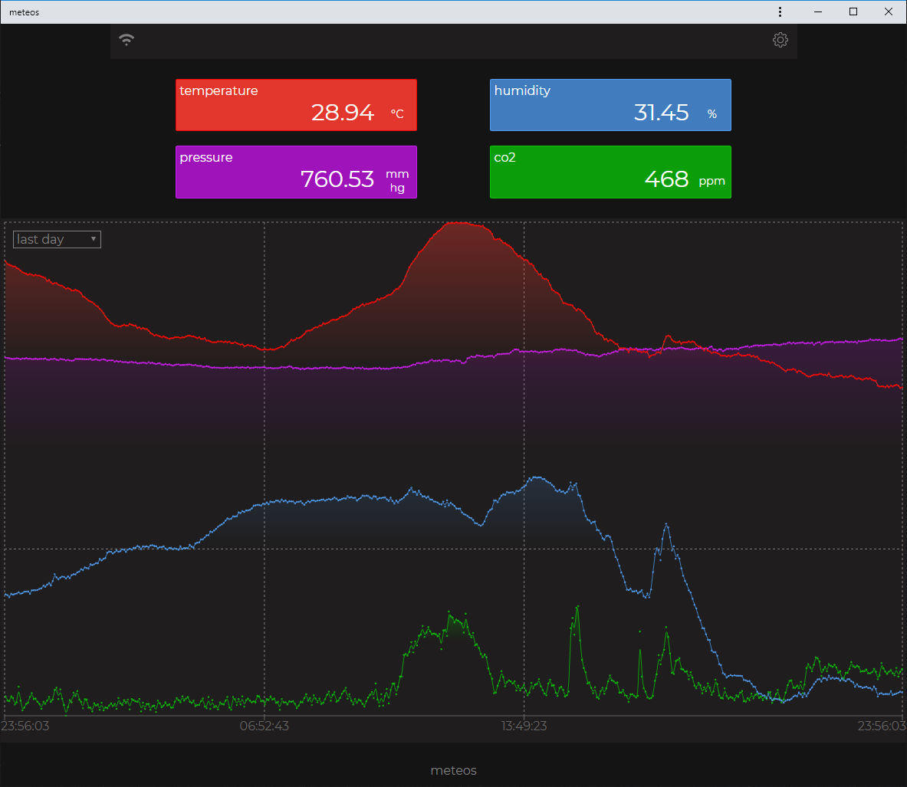
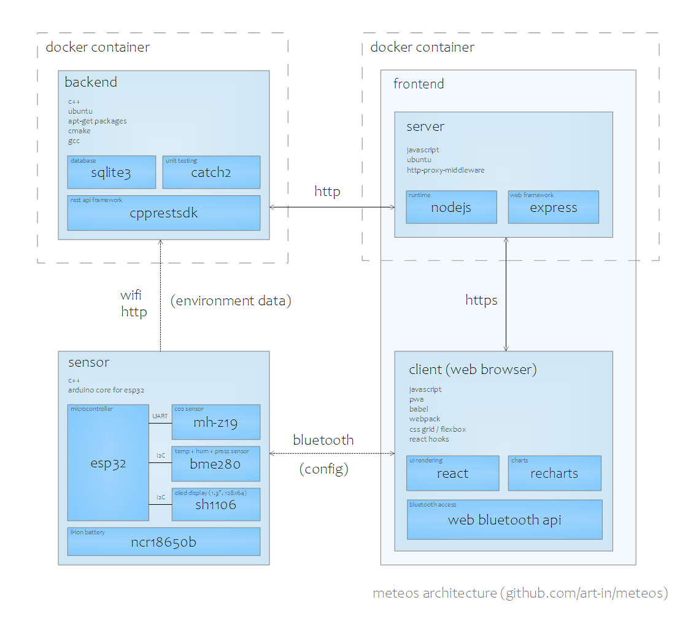

Home weather station on [ESP32](https://en.wikipedia.org/wiki/ESP32) with database and web app.

---

- environment readings:
  - temperature
  - humidity
  - pressure
  - co2
 - sending readings to database over wifi
 - configuring sensor over bluetooth
 - on-board display to show current readings
 - browser web app to show graphs

---

 |  | 
:---: | :---: | :---:

---

---

[Assembling Sensor device (components, circuit diagram, etc.)](docs/sensor/readme.md)
