### Components

component | model | link | photo 
--- | --- | --- | ---
microcontroller | esp32 | [aliexpress](http://aliexpress.com/item/ESP32-ESP-32-ESP32S-ESP-32S-CP2102-Wireless-WiFi-Bluetooth-Development-Board-Micro-USB-Dual-Core/32867696371.html) | 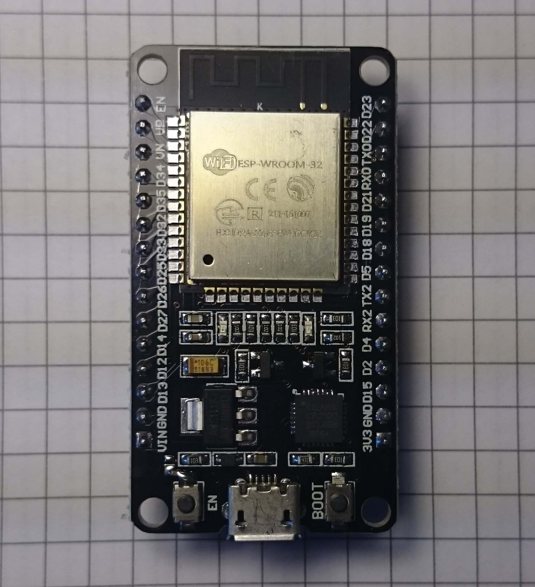
co2 sensor | mh-z19 | [aliexpress](http://aliexpress.com/item/1PCS-module-MH-Z19-infrared-co2-sensor-for-co2-monitor-Free-shipping/32371956420.html) | 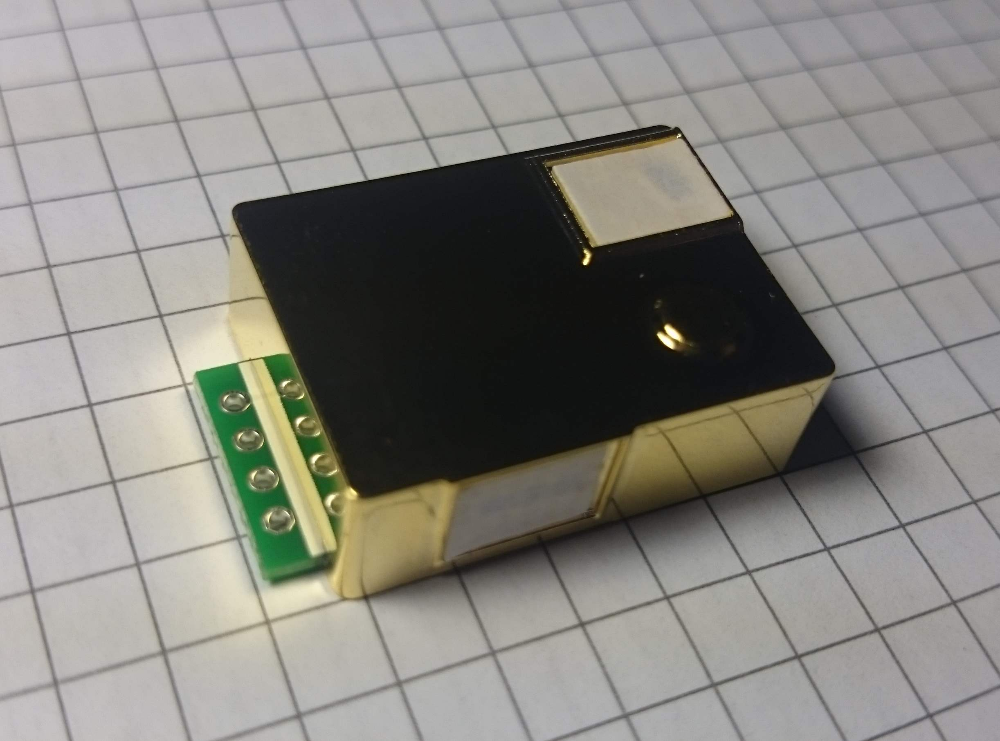
temperature, humidity, pressure sensor | bme280 | [aliexpress](http://aliexpress.com/store/product/BME280/731260_32849462236.html) | 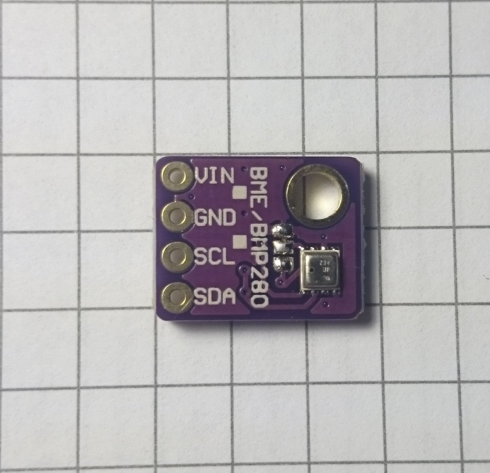
OLED display (1.3", 128 x 64) | sh1106 | [aliexpress](http://aliexpress.com/item/1PCS-1-3-OLED-module-white-color-128X64-1-3-inch-OLED-LCD-LED-Display-Module/32796086867.html) | 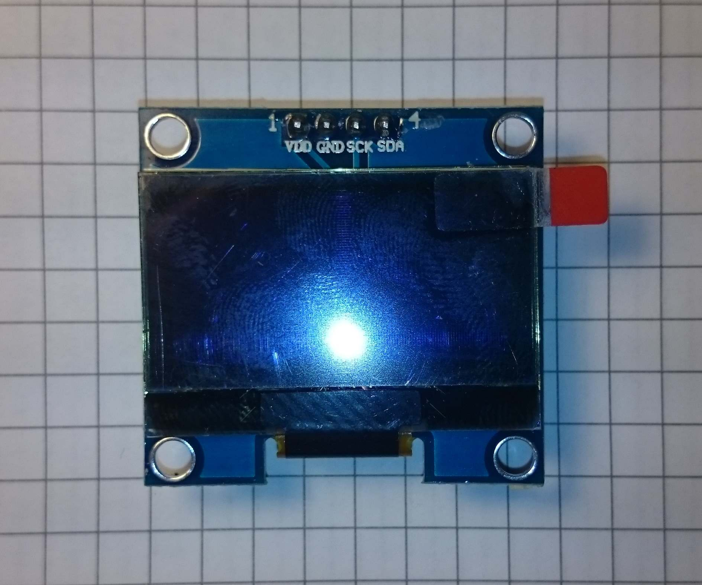
li-ion battery (18650) | ncr18650b | [aliexpress](http://aliexpress.com/item/2PCS-100-New-Original-NCR18650B-3-7-v-3400-mah-18650-Lithium-Rechargeable-Battery-Flashlight-Digital/32324914059.html) | 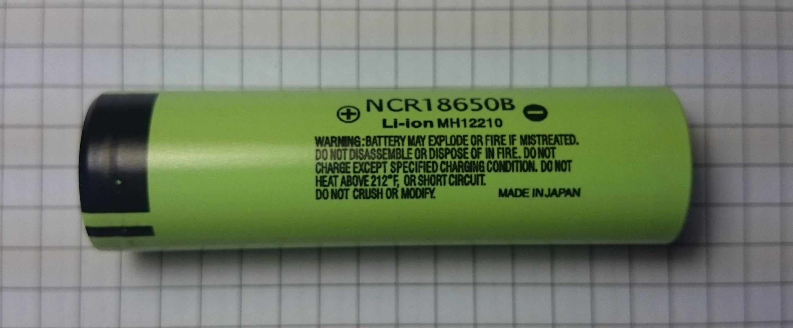
li-ion battery charging board with protection | tp4056 | [aliexpress](http://aliexpress.com/item/1PCS-5V-1A-Micro-USB-18650-Lithium-Battery-Charging-Board-Charger-Module-Protection-Dual-Functions/32467578996.html) | 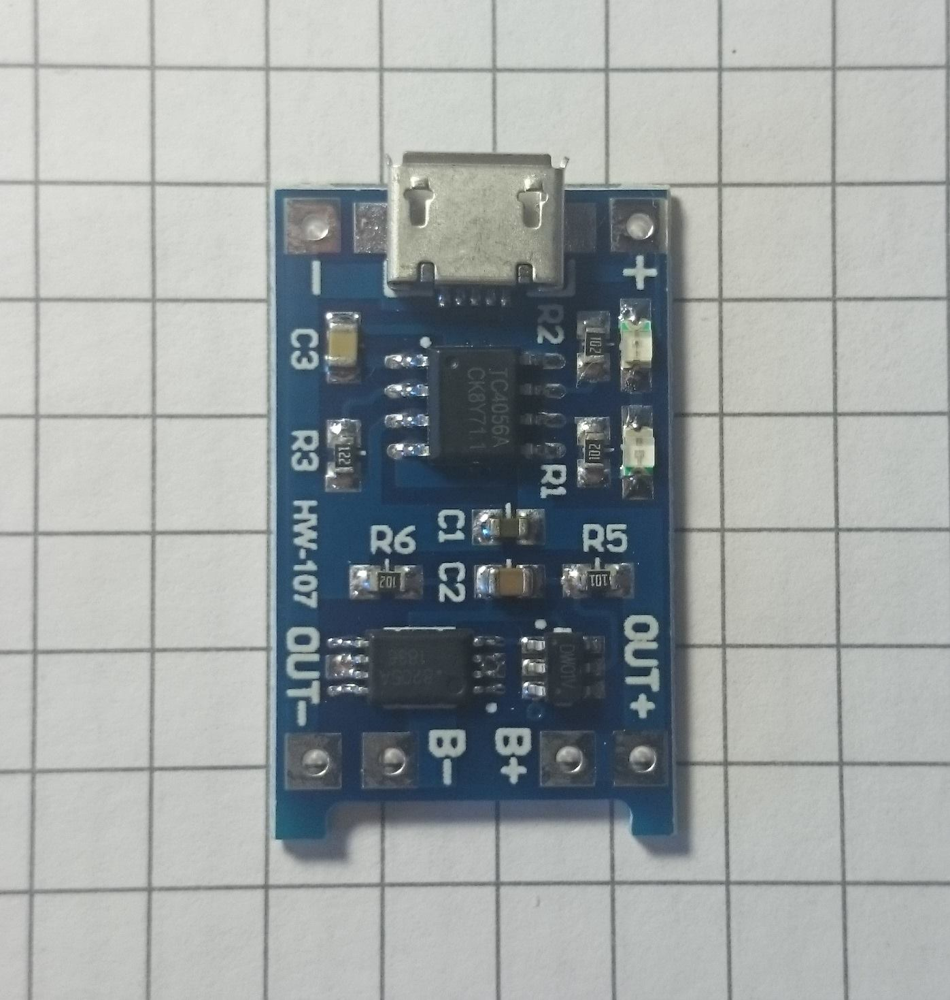
battery case (18650) | - | [aliexpress](http://aliexpress.com/item/High-Quality-18650-Battery-Box-Holder-Batteries-Case-for-4pcs-18650-in-Parallel-3-7V-Pole/32814062027.html) | 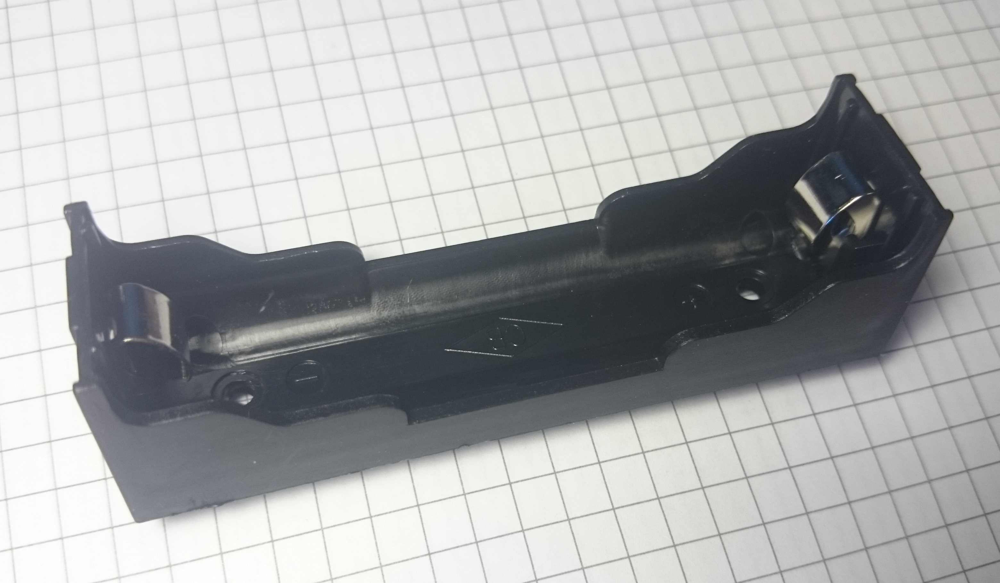
step-up voltage converter (1V-5V to 5V) | - | [aliexpress](http://aliexpress.com/item/5V-DC-DC-Converter-Step-Up-Power-Supply-DC-DC-Booster-Boost-Buck-Converter-Board-Step/32635991770.html) | 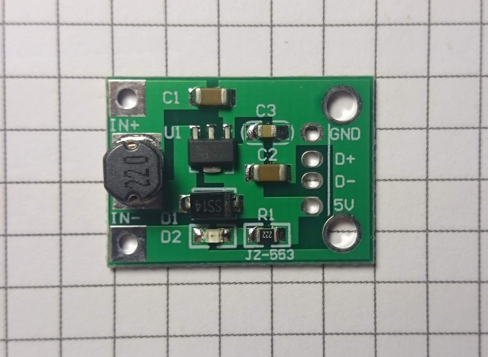
capacitor (1K μF) | - | -
button | - | - | 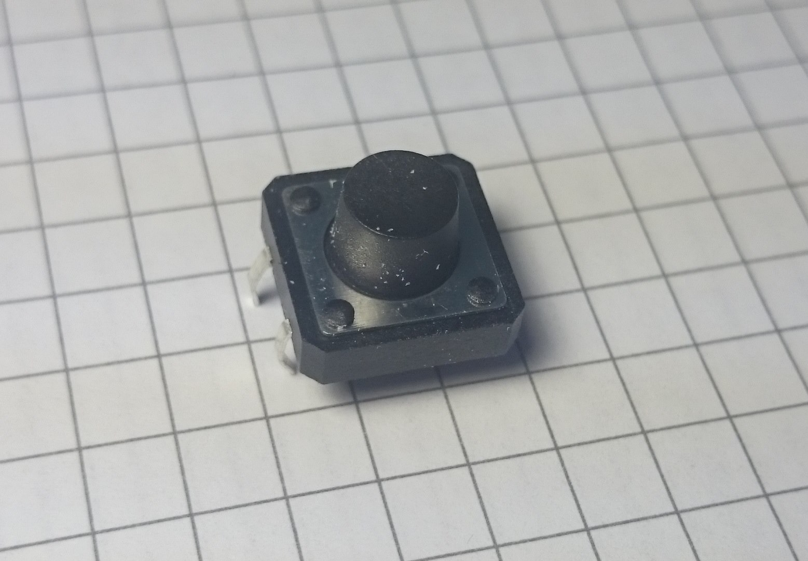
plastic case (105 х 75 х 26.4 mm) | - | [chipdip (RU)](https://www.chipdip.ru/product/g909g) | 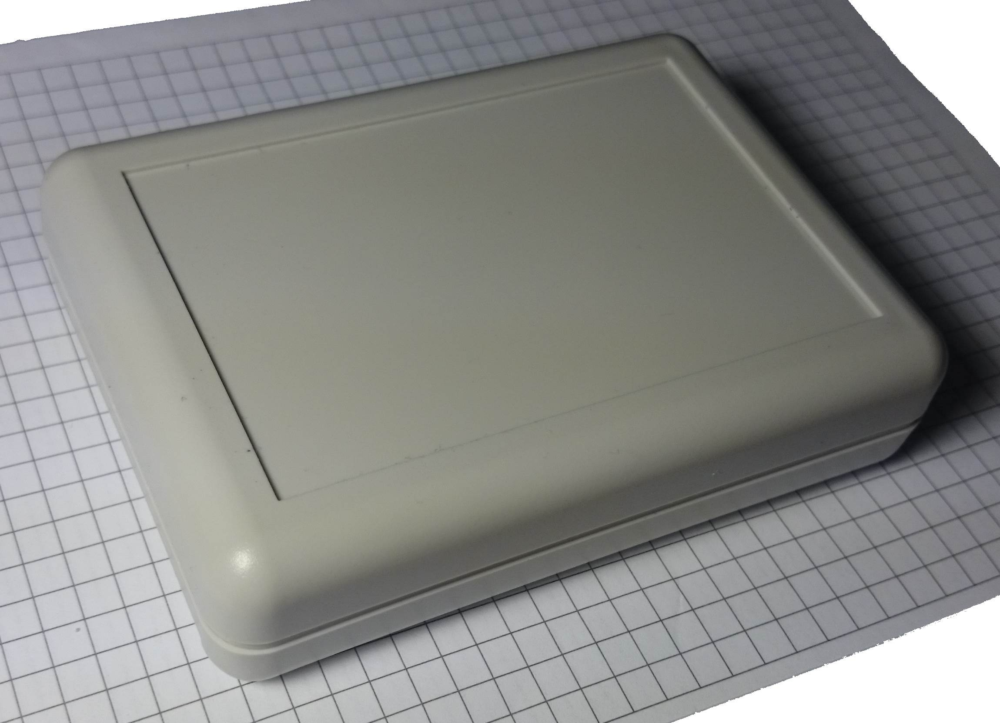   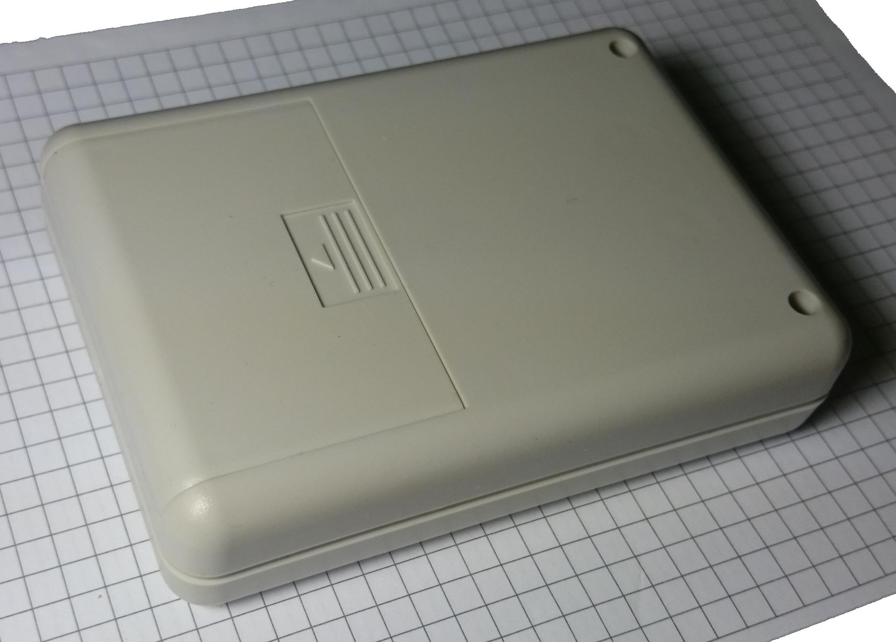

total cost (including shipment from China to Saint-Petersburg, Russia): 2.700 RUB (42 USD)  

most expensive component: co2 sensor - 1.230 RUB (19 USD)  
shipment time: 2-4 weeks

---

### Assembling

_  |  _
-- | --
circuit diagram (TODO) | 
assembling on breadboard | 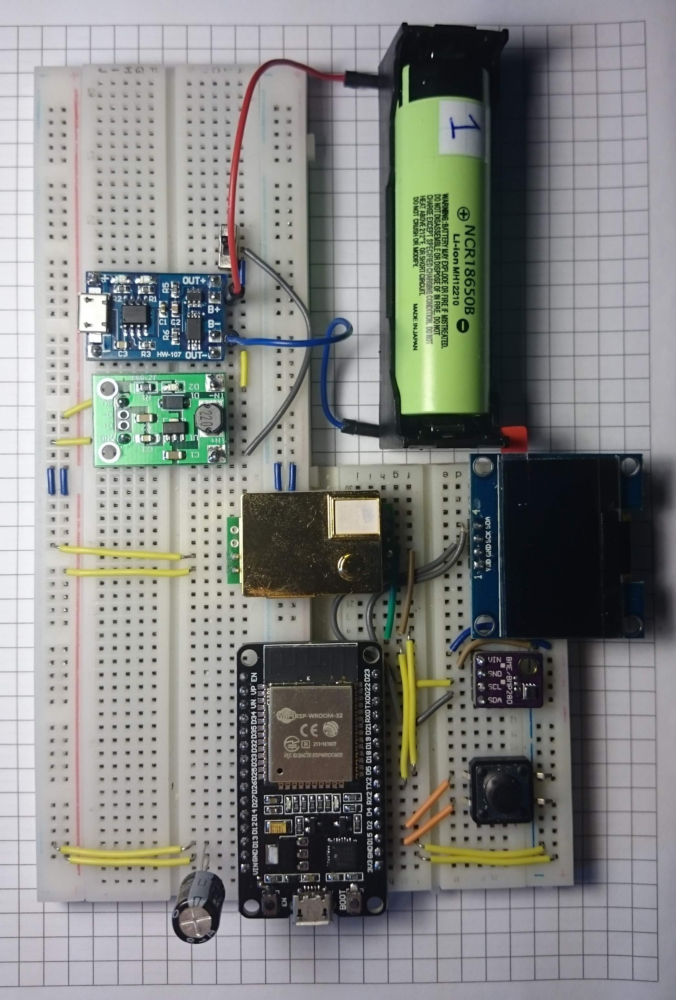
soldering / glueing / drilling / packing in case | 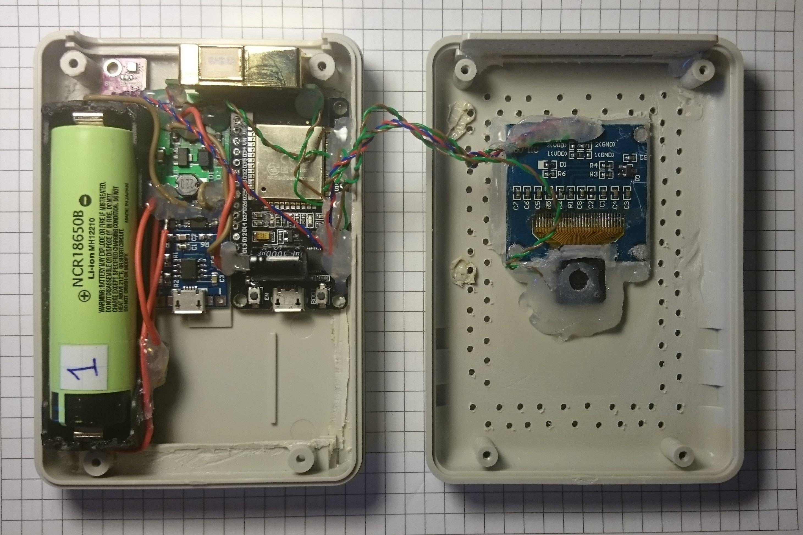
result | 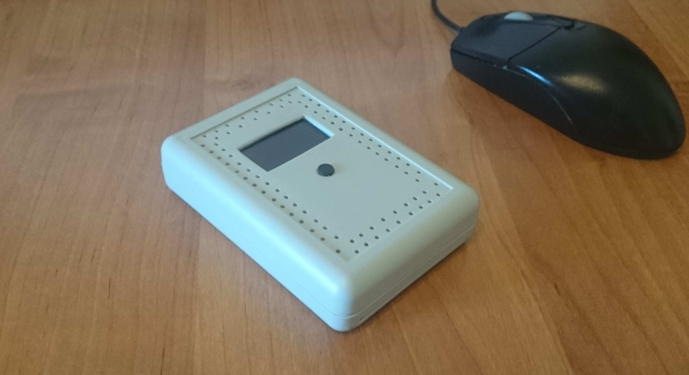
